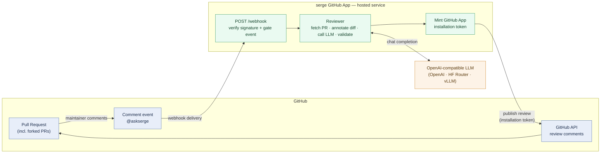

```mermaid
flowchart LR
    subgraph GH["GitHub"]
        PR["Pull Request<br/>(incl. forked PRs)"]
        EV["Comment event<br/>@askserge"]
        API["GitHub API<br/>review comments"]
        PR -->|"maintainer comments"| EV
    end

    subgraph SVC["serge GitHub App — hosted service"]
        WH["POST /webhook<br/>verify signature + gate event"]
        TOK["Mint GitHub App<br/>installation token"]
        REV["Reviewer<br/>fetch PR · annotate diff · call LLM · validate"]
        WH --> REV
        REV --> TOK
    end

    LLM["OpenAI-compatible LLM<br/>(OpenAI · HF Router · vLLM)"]

    EV -->|"webhook delivery"| WH
    REV <-->|"chat completion"| LLM
    TOK -->|"publish review<br/>(installation token)"| API
    API --> PR

    classDef gh fill:#e8eef9,stroke:#5b78b3,color:#1a2b4a;
    classDef svc fill:#eafaf1,stroke:#3a9d6b,color:#13442b;
    classDef ext fill:#fdf3e7,stroke:#d08a32,color:#5a3a0d;
    class PR,EV,API gh;
    class WH,TOK,REV svc;
    class LLM ext;
```
